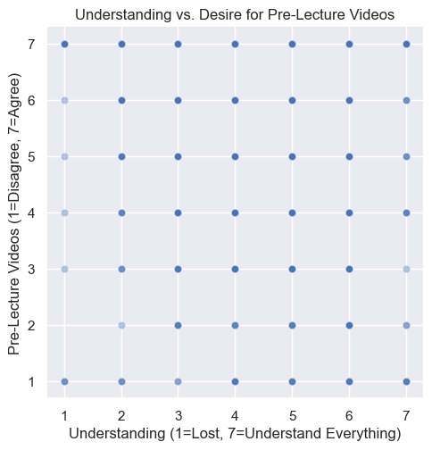
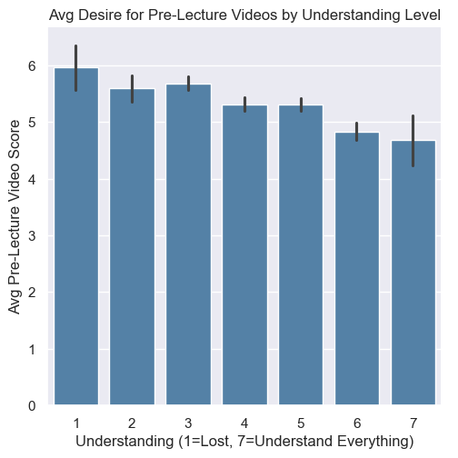
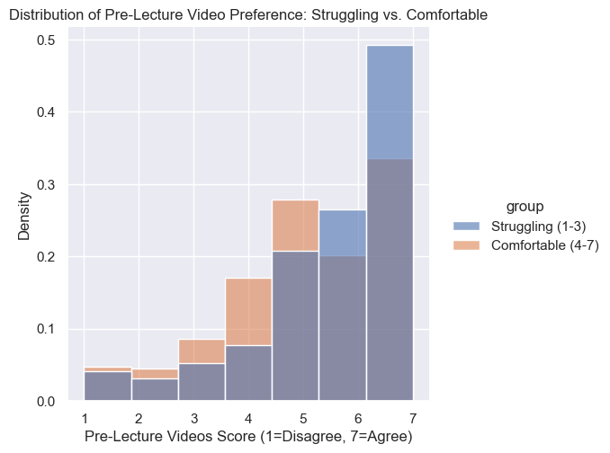

# Do Struggling Students Want Pre-Lecture Videos More?

## The Idea

COMP 110 students come in with wildly different coding backgrounds.
I wanted to know: are students who feel lost the ones most likely to
want optional pre-lecture videos? If so, adding them would be a
low-cost way to support struggling students without changing anything
for students who are already comfortable.

The survey had two relevant columns: `understanding` (1=lost,
7=understand everything) and `pre_lecture_videos` (1=strongly disagree,
7=strongly agree).

## The Analysis

I loaded both survey CSV files, combined them with `concat`, and
cleaned the data down to four columns: `understanding`,
`pre_lecture_videos`, `difficulty`, and `pace`. I used a custom
`filter_by_threshold` helper to split students into struggling
(understanding <= 3) and comfortable (understanding > 3) groups.

### Chart 1: Understanding vs. Desire for Pre-Lecture Videos

The scatter shows demand spread broadly across all understanding
levels, not just among struggling students.

### Chart 2: Average Desire for Pre-Lecture Videos by Understanding Level

Students with the lowest understanding scores (1-2) show slightly
higher average desire for pre-lecture videos, but students at the
highest levels (6-7) also rate them highly.

### Chart 3: Distribution of Preference — Struggling vs. Comfortable

Both groups skew toward agreeing videos would help. The struggling
group has slightly more weight at the high end, but the difference
is modest.

## Conclusion

The data gives moderate support for adding pre-lecture videos, but
demand is high